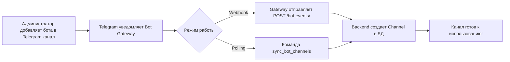

# Быстрый старт: Автоматическая синхронизация каналов

## 🚀 За 3 минуты

### 1. Запустите проект

```bash
docker-compose up -d
docker-compose exec web python manage.py migrate
docker-compose exec web python manage.py createsuperuser
docker-compose exec web python manage.py loaddata initial_languages
```

### 2. Настройте переменные окружения

Отредактируйте `.env`:

```bash
# Telegram Bot Gateway (уже работает!)
TELEGRAM_BOT_SERVICE_URL=http://178.217.98.201:8001
TELEGRAM_BOT_SERVICE_TOKEN=your-secret-token

# Translation Service (опционально)
TRANSLATION_SERVICE_URL=http://translation-service:8002
TRANSLATION_SERVICE_TOKEN=your-translation-token
```

### 3. Импортируйте каналы

```bash
# Одной командой импортировать все каналы, где есть бот
docker-compose exec web python manage.py sync_bot_channels
```

**Вывод:**
```
Starting Telegram Bot channels synchronization...
Connected to bot: @my_channel_bot (ID: 123456789)
Processing bot updates...
Processed 3 updates
  ✓ Update #456789123 (my_chat_member): processed
  
Channels where bot is admin:
  • Crypto News EN (@crypto_news_en) [✓ Active] - post, edit, delete
  • Crypto News RU (@crypto_news_ru) [✓ Active] - post, edit
  
Synchronization completed.
```

### 4. Проверьте в Admin панели

Откройте http://localhost:8000/admin/telegram_channels/channel/

✅ Вы должны увидеть все каналы, где бот является администратором!

## 📋 Как это работает



## 🔄 Режимы синхронизации

### Webhook (Production) — автоматически

Bot Gateway отправляет события на ваш бэкенд в реальном времени.

**Настройка на стороне Gateway:**
```env
EXTERNAL_BACKEND_ENABLED=true
EXTERNAL_BACKEND_URL=https://your-backend.com/api/integrations/telegram-bot
EXTERNAL_BACKEND_TOKEN=<ваш токен>
```

### Polling (Development) — вручную/периодически

**Вручную:**
```bash
python manage.py sync_bot_channels
```

**Автоматически через Celery Beat:**  
Уже настроено в `settings/base.py` — каждые 5 минут.

## 🎯 Следующие шаги

### 1. Создайте группу каналов

**Admin панель → Channel Groups → Add**

- Name: `Crypto News`
- Primary Channel: выберите основной канал (English)
- Добавьте другие каналы в эту группу

### 2. Создайте мультиканальный пост

**Admin панель → Multi-Channel Posts → Add**

- Group: `Crypto News`
- Primary Channel: `Crypto News EN`
- Primary Text (Markdown):
  ```markdown
  **Breaking News!**
  
  Bitcoin hits new ATH at $100,000! 🚀
  
  [Read more](https://example.com/article)
  ```
- Auto-translate enabled: ✅
- Save

### 3. Опубликуйте

После сохранения пост автоматически:
1. ✅ Создаст варианты для всех каналов в группе
2. 🌐 Переведёт на другие языки (если включено)
3. 📤 Будет готов к публикации

Нажмите **"Publish to all channels"** — готово!

## ⚙️ Настройка автопубликации

Если вы хотите автоматически публиковать посты после создания:

```python
# backend/apps/posts/signals.py

from django.db.models.signals import post_save
from django.dispatch import receiver
from .models import MultiChannelPost
from .tasks import publish_multi_post

@receiver(post_save, sender=MultiChannelPost)
def auto_publish_on_ready(sender, instance, created, **kwargs):
    if instance.status == 'ready_for_publish':
        publish_multi_post.delay(instance.pk)
```

## 🐛 Troubleshooting

### Каналы не появляются

**Проверьте:**
```bash
# 1. Bot Gateway работает
curl http://178.217.98.201:8001/health

# 2. Бот добавлен как АДМИНИСТРАТОР (не участник!)
# В Telegram: Channel Info → Administrators → Add Admin

# 3. Токен правильный
docker-compose exec web python manage.py shell
>>> from apps.integrations.telegram_bot.client import TelegramBotClient
>>> client = TelegramBotClient()
>>> info = client.get_bot_info_sync()
>>> print(info)

# 4. Запустите синхронизацию вручную
docker-compose exec web python manage.py sync_bot_channels
```

### Права бота некорректны

```bash
# Обновить права для всех каналов
docker-compose exec web python manage.py shell -c "
from apps.integrations.telegram_bot.tasks import verify_all_channel_permissions
verify_all_channel_permissions.delay()
"
```

### Webhook не работает (для production)

```bash
# Проверьте доступность эндпоинта
curl -X POST https://your-backend.com/api/integrations/telegram-bot/bot-events/ \
  -H "X-Bot-Token: your-token" \
  -H "Content-Type: application/json" \
  -d '{"event":"test","chat_id":123,"chat_title":"Test"}'

# Должен вернуть 200 OK или 401 (если токен неверный)
```

## 📚 Дополнительная информация

- [Подробное руководство](docs/bot_channels_sync.md)
- [API документация Gateway](API%20(2).md)
- [REST API бэкенда](docs/api.md)
- [Руководство пользователя](docs/guide.md)

## 🆘 Нужна помощь?

1. Проверьте логи: `docker-compose logs -f web`
2. Включите DEBUG режим: `DEBUG=True` в `.env`
3. Запустите тесты: `docker-compose exec web pytest`

---

**Готово!** Теперь каналы синхронизируются автоматически, и вы можете управлять ими через Admin панель! 🎉

